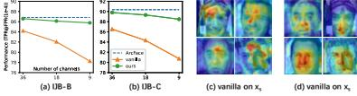
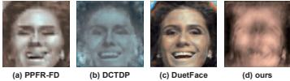
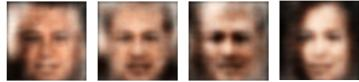

# Privacy-Preserving Face Recognition Using Random Frequency Components

Yuxi Mi1\* Yuge Huang2\* Jiazhen Ji2 Minyi Zhao1  
Jiaxiang Wu2 Xingkun Xu2 Shouhong Ding2 Shuigeng Zhou1†

1 Fudan University 2 Tencent Youtu Lab

{yxmi20, zhaomy20, sgzhou}@fudan.edu.cn

{yugehuang, royji, willjxwu, xingkunxu, ericshding}@tencent.com

## Abstract

The ubiquitous use of face recognition has sparked increasing privacy concerns, as unauthorized access to sensitive face images could compromise the information of individuals. This paper presents an in-depth study of the privacy protection of face images' visual information and against recovery. Drawing on the perceptual disparity between humans and models, we propose to conceal visual information by pruning human-perceivable low-frequency components. For impeding recovery, we first elucidate the seeming paradox of reducing model-exploitable information and retaining high recognition accuracy. Based on recent theoretical insights and our observation on model attention, we propose a solution to the dilemma, by advocating for the training and inference of recognition models on randomly selected frequency components. We distill our findings into a novel privacy-preserving face recognition method, PartialFace. Extensive experiments demonstrate that PartialFace effectively balances privacy protection goals and recognition accuracy. Code is available at: <https://github.com/Tencent/TFace>.

## 1. Introduction

Face recognition (FR) is a landmark biometric technique that enables a person to be identified or verified by face. It has seen remarkable methodological breakthroughs and rising adoptions in recent years. Currently, considerable applications of face recognition are carried out online to bypass local resource constraints and to attain high accuracy [19]: Face images are collected by local devices such as cell phones or webcams, then outsourced to a service provider, that uses large convolutional neural networks (CNN) to extract the faces' identity-representative templates and matches them with records in its database.

| Method          | acc                | privacy            |
|-----------------|--------------------|--------------------|
| (a) pruning     | High (green check) | Low (red X)        |
| (b) vanilla     | Low (red X)        | High (green check) |
| (c) PartialFace | High (green check) | High (green check) |

Figure 1: Paradigm comparison among other frequency-based methodologies and PartialFace. The diagram shows three paths: (a) pruning, (b) vanilla, and (c) PartialFace. Each path starts with a face image, goes through a frequency-based processing step, and then through a model. The results are shown in a table with 'acc' (accuracy) and 'privacy' indicators.

Figure 1. Paradigm comparison among other frequency-based methodologies and PartialFace. (a) Pruning low-frequency channels can conceal visual information but stop no recovery. (b) A vanilla method that uses fixed channel subsets to impede recovery suffers downgraded accuracy. (c) PartialFace addresses the dilemma by training and inferring from random channels.

During the process, the original face images are often considered sensitive data under regulatory demands that are unwise to share without privacy protection. This fosters the studies of *privacy-preserving face recognition* (PPFR), where cryptographic [7, 8, 14, 17, 21, 33, 44, 47] and perturbation-based [3, 12, 18, 28–30, 46, 48] measures are taken to prevent face images from unauthorized access of, e.g., wiretapping third parties. Face images are converted to protective representations that their visual information is both *concealed* and *cannot be easily recovered* [2].

This paper advocates a novel PPFR scheme, to learn face images from random combinations of their partial frequency components. Our proposed PartialFace can protect face images' visual information and prevent recovery while maintaining the high distinguishability of their identities.

We start with the disparity in how humans and models perceive images. Recent image classification studies suggest that models' predictions are determined mainly by the images' high-frequency components [39, 45], which carry negligible visual information and are barely picked up by humans. We extend the theory to face recognition from a

\*Equal contributions.

†Corresponding author.

privacy perspective, to train and infer the model on *pruned* frequency inputs: As depicted in Fig. 1(a), we decouple the face images’ frequency compositions via *discrete cosine transform* (DCT), which breakdown every spatial domain into a certain number of (typically 64) constituent bands, *i.e.*, *frequency channels*. We prune the human-perceivable low-frequency channels and exploit the remaining. We find the processed face images become almost visually indiscernible, and the model still works accurately.

Pruning notably conceals visual information. However, to what degree can it impede recovery? We define recovery as the general attempts to reveal the faces’ visual appearances from shared protected features using trained attack models. Notice we may prune very few (say, about 10) channels, if according to human perception. At the same time, the remaining high-frequency channels being shared, hence exposed, are quite numerous and carry a wealth of model-perceivable features. While the information abundance can benefit a recognition model, it is also exploitable by a model carrying out attacks, as both may share similar perceptions. Therefore, as we later experimentally show, the attacker can recover visual features from high-frequency channels with ease in the absence of additional safeguards, rendering privacy protection useless.

An intuitive tactic to reinstate protection is to reduce the attacker’s exploitable features by training on a small portion of fixed channels, as shown in Fig. 1(b). However, we find the reduction also severely impairs the accuracy of trained recognition models. Evidence on the models’ attention, as later shown, attributes their utility downgrade to being incapable of learning a complete set of facial features, as vital channels describing some local features may be pruned.

Training on subsets of channels hence seems contradictory to the privacy-accuracy equilibrium. Fortunately, we can offer a reconciliation getting inspired by a recent time-series study [51]. It proves under mild conditions, models trained on *random* frequency components can preserve more entirety’s information than on *fixed* ones, plausibly by alternately learning from complementary features. We hence propose a novel address to the equilibrium based on its theoretical findings and our observation on model attention: For any incoming face image, we arbitrarily pick a small subset of its high-frequency channels. Therefore, our recognition model is *let trained and inferred from image-wise random chosen channels*, illustrated in Fig. 1(c).

We further show that randomness can be adjusted to a moderate level, by choosing channels from pre-specified combinations and perturbations called *ranks*, to keep privacy protection while reconciling technical constraints to ease training. At first glance, our randomized approach may seem counter-intuitive as it is common wisdom that models require consistent forms of inputs to learn stably. However, since DCT produces spatially correlated frequency channels

that preserve the face’s structural information, as later illustrated in Fig. 3, it turns out the model generalizes quite naturally. Experimental analyses shows our PartialFace well balances privacy and accuracy.

The contributions of our paper are three-fold:

1. We present an in-depth study of the privacy protection of face images, regarding the privacy goals of concealing visual information and impeding recovery.
2. We propose two methodological advances to fulfill the privacy goals, pruning low-frequency components and using randomly selected channels, based on the observation of model perception and learning behavior.
3. We distill our findings into a novel PPFR method, PartialFace. We demonstrate by extensive experiments that our proposed method effectively safeguards privacy and maintains satisfactory recognition accuracy.

## 2. Related work

### 2.1. Face recognition

The current method of choice for face recognition is CNN-based embedding. The service provider trains a CNN with a softmax-based loss to map face images into one-dimensional embedding features which achieve large inter-identity and small intra-identity discrepancies. While the state-of-the-art (SOTA) FR methods [6, 20, 38] achieve impressive task utility in real-world applications, their attention to privacy protection could be deficient.

### 2.2. Privacy-preserving face recognition

The past decade witnessed significant advances in privacy-preserving face recognition [24, 25, 41]. We roughly categorize the related arts into two branches:

**Cryptographic methods** perform recognition on encrypted images, or by executing dedicated security protocols. Many pioneering works fall under the category of homomorphic encryption (HE) [8, 14, 33] or secure multiparty computation (MPC) [21, 44, 47], to securely carry out necessary computations such as model’s feature extraction. Some methods also employ various crypto-primitives including one-time-pad [7], matrix encryption [17], and functional encryption [1]. The major pain points of these methods are generally high latency and expensive computational costs.

**Perturbation-based methods** transform face images into protected representations that are difficult for unauthorized parties to discern or recover. Many methods leverage differential privacy (DP) [3, 18, 22, 48], in which face images are obfuscated by a noise mechanism. Some use autoencoders [28] or adversarial generative networks (GAN) [18, 29] to recreate visually distinct faces that maintain a constant identity. Others compress the original images into

![Figure 2: Pipeline of PartialFace. The diagram is divided into three main sections: 1. Pruning low-frequency channels: A face image X is transformed into frequency channels (X_LF and X_HF). Low-frequency channels are pruned. 2. Sample subsets from pre-specified combinations: A heatmap shows combinations of channels. A selection process chooses a subset S from combinations {S_{d \times s}, P_{s \times s}}. This is followed by permutation to create X_H \cdot S \cdot P'. 3. Train / infer from random subsets: The model is trained on random subsets (choose r) and then used for inference on new samples (choose l). A legend at the bottom defines icons for Training/Trained Model, Server, Client, Face Image, Recognition, Training Data, Discard LF Channels, Sample Combinations, and Randomly Sample Subset(s).](b230b8f21d8e82d55c0d311c8c32ef73_img.jpg)

Figure 2: Pipeline of PartialFace. The diagram is divided into three main sections: 1. Pruning low-frequency channels: A face image X is transformed into frequency channels (X\_LF and X\_HF). Low-frequency channels are pruned. 2. Sample subsets from pre-specified combinations: A heatmap shows combinations of channels. A selection process chooses a subset S from combinations {S\_{d \times s}, P\_{s \times s}}. This is followed by permutation to create X\_H \cdot S \cdot P'. 3. Train / infer from random subsets: The model is trained on random subsets (choose r) and then used for inference on new samples (choose l). A legend at the bottom defines icons for Training/Trained Model, Server, Client, Face Image, Recognition, Training Data, Discard LF Channels, Sample Combinations, and Randomly Sample Subset(s).

Figure 2. Pipeline of PartialFace. DCT turns face images into the frequency domain, where low-frequency channels are first pruned to remove the human perception. A small subset of channels is selected and permuted at random according to pre-specified combinations  $\{S, P\}$ , or ranks. The model is trained and inferred from random subsets to address the equilibrium between accuracy and privacy.

compact representations by mapping discriminative components into subspaces [4, 16, 27], or anonymize the images by clustering their features [12]. These methods face a common bottleneck of task utility: As the techniques they employ essentially distort the original images, their protection often impairs recognition accuracy.

### 2.3. Learning in the frequency domain

Converting spatial or temporal data into the frequency domain provides a powerful way to extract interesting signals. For instance, the Fourier-based *discrete cosine transform* [5] is used by the JPEG standard [37] to enable image compression. Researches in deep learning [9, 45] suggest models trained on images’ frequency components can perform as well as trained on the original images. Advance [39] further reveals humans and models perceive low- and high-frequency components differently. In the realm of PPFR, three recent methods [15, 26, 42] are closely related to ours as we all conceal visual information by exploiting the split in human and model perceptions. However, these methods bear inadequacy in defending recovery, according to our previous discussion of channel redundancy and later testified in experiments.

## 3. Methodology

This section discusses the motivation and technical details behind PartialFace. PartialFace is named after its key protection mechanism, where the model only exploits face images’ partial frequency components to reduce information exposure. Figure 2 describes its framework.

### 3.1. Overview

Recall our privacy goals are to conceal the face images’ visual information and to prevent recovery attacks on them. They respectively target the adversarial capability of hu-

mans and models. We naturally concretize them into two technical aims, on *how to eliminate human perception*, and, on *how to reduce exploitable information for attack models*.

To eliminate human perception, we leverage the finding that models’ utility can be maintained almost in full on the images’ high-frequency channels [39]. Contrarily, humans mostly perceive the images’ low-frequency channels, as only they carry signals of conspicuous amplitude for human eyes to discern. Whereby spatial-frequency transforms, these channels can be easily located and pruned from raw images. We concretely opt for DCT as our transform as it facilitates the calculation of *energy*, to serve as the quantification for human perceivable information. Experimentally, we can prune a very small portion of channels to eliminate 95% of total energy, hence satisfying our aim.

Reducing the attacker’s exploitable information requires further pruning of high-frequency channels, as previously discussed. However, it is equally crucial to maintain the recognition model’s accuracy, which presents a seeming dilemma, as the training features utilizable by recognition and attack models are tightly interwoven in these channels. We offer a viable way as our major contribution: We notice different channel subsets each carrying certain local facial features. Hence, we feed the model with a random subset from each face image, with the hope to let the model learn the entire face’s impression from different images’ complementary local feature partitions. This approach is proved feasible by recent theoretical studies [51] and demonstrated by our experiments. Therefore, information exposure is minimized as only each image’s chosen subset is exposed, and the model still performs surprisingly well.

Despite being well justified by theory, we find sampling channels under complete randomness could under-perform in actual training due to two technical limitations: the inadequacy in training samples and the biased sampling within mini-batches. We propose two targeted fixes to reconcile

Figure 3: The DCT process. (a) original X: A face image of size H x W. (b) up-sampled spatial channels: The image is up-sampled to 8H x 8W. (c) frequency spectrum: A 2D grid of frequency channels of size 64 x 64. (d) frequency channels: A single frequency channel of size H x W. Arrows indicate the flow from (a) to (b), (b) to (c), and (c) to (d).

Figure 3. The DCT process. The produced (d) frequency channels keep the spatial structure to (a) the original image, though only low-frequency channels are discernible by humans. We use (c) 2D grids to describe the frequency spectrum. Each cell in the grid represents one frequency channel of  $H \times W$ .

the constraints, by augmenting samples and seeking a moderate level of randomness. We find the modified approach satisfactorily addresses the privacy-accuracy equilibrium.

### 3.2. Conceal visual information

We first set up some basic notions:  $\langle X, y \rangle$  denotes a data sample of a face image and its corresponding label.  $x$  denotes the frequency composition of  $X$  and  $x_i$  denotes its individual frequency channels.  $f(\cdot; \theta)$  denotes the recognition model parameterized by  $\theta$ .  $l(\cdot, \cdot)$  denotes a generic loss function (e.g., ArcFace).  $\mathcal{T}(\cdot)$  denotes the discrete cosine transform and  $\mathcal{T}^{-1}(\cdot)$  denotes its inverse transform.

To conceal visual information, recall humans and models mainly perceive low- and high-frequency components, respectively. Therefore, we need to find a frequency decomposition of  $X = \{x_l, x_h\}$ , where  $x_l, x_h$  are the respective low- and high-frequency channels, then prune  $x_l$ .

We presume  $X$  is with the shape of  $(H, W)$ . We employ DCT to transform  $X$ 's spatial channels into a frequency spectrum. While an RGB image typically has 3 spatial channels, we pick one for simplicity. We perform an 8-fold up-sampling ahead to turn  $X$  into  $(8H, 8W)$ . As DCT later divides  $H$  and  $W$  by 8, this makes sure the resulting frequency channels can be fed into the model as usual. Figure 3 illustrates the process of DCT, where  $x = \mathcal{T}(X)$ . Concretely,  $X$  is divided into  $(8, 8)$ -pixel blocks. DCT turns each block into a 1D array of 64 frequency coefficients and reorganizes all coefficients from the same frequency across blocks into an  $(H, W)$  frequency channel (there are 64 of them), that is spatially correlated to the original  $X$ . As a result,  $X$  is turned into  $x$  of  $(64, H, W)$ .

We then decouple  $x$  into  $\{x_l, x_h\}$ . Notice that human-perceivable low-frequency channels should meanwhile be those with higher amplitude, as humans preferentially identify signals with conspicuous value changes. We measure a channel's amplitude by its *channel energy*  $e(\cdot)$ , which is the mean of amplitudes of all its elements:

$$e(x) = \frac{1}{HW} \sum_{i=0}^{H-1} \sum_{j=0}^{W-1} |x^{i,j}|. \quad (1)$$

![Figure 4: The visual appearance and recovery of an example image. The diagram shows a sequence of images: 'original face X' (a face), 'a) HF channels x_h' (high-frequency channels), 'b) subset x_h, S-P' (a subset of high-frequency channels), and 'c) random subset' (a random subset of high-frequency channels). Arrows indicate the flow from 'original face X' to 'a)', 'a)' to 'b)', and 'b)' to 'c)'. On the right, a vertical arrow labeled 'visual information' points down, and a vertical arrow labeled 'recovery' points up, indicating the process of recovering the original image from the subset.](7a207f7bb5a20f849aee089439e24a84_img.jpg)

Figure 4: The visual appearance and recovery of an example image. The diagram shows a sequence of images: 'original face X' (a face), 'a) HF channels x\_h' (high-frequency channels), 'b) subset x\_h, S-P' (a subset of high-frequency channels), and 'c) random subset' (a random subset of high-frequency channels). Arrows indicate the flow from 'original face X' to 'a)', 'a)' to 'b)', and 'b)' to 'c)'. On the right, a vertical arrow labeled 'visual information' points down, and a vertical arrow labeled 'recovery' points up, indicating the process of recovering the original image from the subset.

Figure 4. The visual appearance and recovery of an example image of (a) after pruning, (b) a fixed subset, and (c) a random subset. This shows protection is enhanced by removing human perception, reducing the number of channels, and randomness, respectively.

We choose  $\sigma=10$  highest-energy channels as  $x_l$  to be available to models. We experimentally find  $\sum_{x \in x_l} e(x) \geq 0.95 \sum_{x \in x} e(x)$ , and a model trained with  $\arg \min_{\theta} l(f(x_l, \theta), y)$  obtain close accuracy to one trained with  $\arg \min_{\theta} l(f(x, \theta), y)$ . For privacy, example of a channel-pruned image in Fig. 4(a) show that most visual information is concealed. While its recovery is still carried out quite successfully, we are to address the issue in the following.

### 3.3. Impede easy recovery

To elucidate the seeming dilemma between reducing model-available channels and retaining high recognition accuracy, we first introduce an intuitive protection, referred to as the *vanilla* method. It trains models on a *fixed* small subset of channels straightforwardly: Concretely for every  $X$ , the model pick  $s < d$  channels  $x_s = (x_{a_1}, \dots, x_{a_s})$  from its high-frequency  $x_h = (x_1, \dots, x_d)$ , where  $a_1 < a_2 < \dots < a_s$  are fixed indices. We benchmark the trained model on IJB-B/C with  $s=9, 18, 36$  and  $d=54$ , and verify its privacy.

The model indeed effectively prevents recovery, as in Fig. 4(b) its recovered image is very blurred. However, the benchmark in Fig. 5(a-b) suggests its accuracy dropped by at most 9%. To find out why is the model's performance impaired, we inspect its attention via Grad-CAM [34]. Results are exemplified in Fig. 5(c-d), which we note show similar patterns among different face images. We derive two observations: (1) Unlike high-utility models that typically have attention to the full face, this model only gains attention to certain local features, which suggests some vital face-describing information is missing in  $x_s$ ; (2) By training vanilla models on different  $x_s$ , we find it can acquire distinct information from different channels, suggesting its attention is correlated to the specific choices of  $x_s$ .

The first observation suggests the cause of the accuracy downgrade. Meanwhile, the second pursues us to consider a viable bypass: We can gather complementary local features from different images and initiate mixed training, to let the

Figure 5 consists of four subplots. (a) UB-B: A line graph showing Performance (FPR@10%) on the y-axis (0 to 100) versus Number of channels on the x-axis (0 to 10). Three lines are shown: 'Protected' (blue dashed line, constant at ~95%), 'vanilla' (orange solid line, decreasing from ~95% to ~75%), and 'PartialFace' (green dashed line, constant at ~95%). (b) UB-C: A line graph showing Performance (FPR@10%) on the y-axis (0 to 100) versus Number of channels on the x-axis (0 to 10). Three lines are shown: 'Protected' (blue dashed line, constant at ~95%), 'vanilla' (orange solid line, decreasing from ~95% to ~75%), and 'PartialFace' (green dashed line, constant at ~95%). (c) vanilla on  $x_s$ : A 3x3 grid of heatmaps showing attention maps for different channels. (d) vanilla on  $x_s$ : A 3x3 grid of heatmaps showing attention maps for different channels.

Figure 5: Privacy and accuracy dilemma. (a) UB-B: Performance vs Number of channels. (b) UB-C: Performance vs Number of channels. (c) vanilla on x\_s: Attention maps for different channels. (d) vanilla on x\_s: Attention maps for different channels.

Figure 5. The privacy and accuracy dilemma. (a-b) The vanilla model trained on fixed channels under-performs on UB-B/C (orange), compared to the unprotected baseline (blue) and PartialFace (green). (c-d) The model gains local attention on foreheads and cheeks, suggesting missing face-describing information. The attention varies by the specific choice of  $x_s$ .

model learn a holistic impression of the entirety while keeping the individual information exposure minimized. Our idea is corroborated by [51], which proves in time-series, training models on random frequency components can preserve more information compared to training on fixed ones.

We concrete our theory into a randomized strategy, by advocating training and inferring the recognition model on image-wise randomly chosen channels. Formally, we construct matrix  $S \in \{0, 1\}^{d \times s}$ , with  $s_{ij}=1$  if  $i=a_j$  and  $s_{ij}=0$  if otherwise. We also construct permutation matrix  $P \in \{0, 1\}^{s \times s}$ . For each  $X$ , we draw  $(a_1, \dots, a_s)$  (therefore  $S$ ) and  $P$  uniformly at random, and calculate

$$x_s = x_h \cdot S \cdot P. \quad (2)$$

Here,  $S$  randomly pick  $s$  channels out of  $x_h$ , then their order is permuted by  $P$ . We introduce  $P$  to further impede recovery, as later discussed in Sec. 3.5. The model is trained in the same way as standard FR using  $\langle x_s, y \rangle$ . However, it *does not require* to know the sample-wise specific  $\{S, P\}$ , which is favorable for privacy. The approach sounds a bit counter-intuitive since receiving random inputs seems to mess with the model’s understanding. However, recall that the DCT frequency channels are spatially correlated to  $X$  and each other. The randomness only pertains to the frequency spectrum while the face’s structural information is preserved and unaltered. The model, therefore, can associate different  $x_s$  to the same  $X$  quite naturally.

### 3.4. Reconcile technical constraints

Equation (2) distills our core idea to sampling  $x_s$  at complete random. However, for practical training, there need to further reconcile two *technical constraints* to achieve satisfying model performance: First to note that  $\langle x_s, y \rangle$  are more varied in feature representations than the unprotected  $\langle X, y \rangle$ , owing to the randomized frequency. It hence could plausibly take the model with more training samples and a longer training time to approach a well-generalized convergence. Second, ideally, channels at random should be sampled with equal probability to ensure balanced learning of different local features. However, when the training data

is partitioned into small mini-batches, sampling is often less unbiased batch-wise so the occurrence of different channel combinations may vary greatly, which we find could undermine the training stability.

Targeting the constraints, we slightly adjust our established approach in two ways. We first augment the training dataset by picking multiple  $x_s$  each time from a face image  $X$ : From  $X$  we sample  $\{x_s^1, \dots, x_s^r\}$ , where  $r$  determines the degree of augmentation. Each  $x_s^i$  is independently drawn and appended to the training dataset as individual training samples. The dataset is then fully shuffled so that  $x_s^i$  corresponding to the same face image cannot be easily associated.

We also control the randomness to a moderate level by specifying the possible combinations of  $S, P$  in advance. Concretely, we opt for choosing one  $S, P$  from  $S=\{S_1, \dots, S_m\}$  and  $P=\{P_1, \dots, P_n\}$  respectively, where  $S, P$  are determined by the service provider. We specifically require  $\{S_1, \dots, S_n\}$  to be a non-overlapping partition of channels from  $x_h$  (i.e., divide  $x_h$  into equal-length subsets) to maximize the use of  $x_h$  and reduce model bias. Therefore, each  $x_s^i$  is picked from one of  $m \times n$  fixed combinations of channels, called *ranks*. This allows us to facilitate the training and overcome sampling biases. The service provider shares  $\{S, P\}$  with all local devices, so the latter can generate their query  $x_s$  accordingly. During inference, the model is expected to provide *consistent* results of the same query  $X$  regardless of the choice of rank, since it learned about a mapping from local features to the face’s entirety. We later testify to it in Sec. 4.3. Meanwhile, the model is still unaware of the sample-wise specific choice of  $\{S, P\}$  as the recognition relies on nothing else but  $x_s$  alone. Hence privacy is maintained.

To conclude, we present PartialFace that train and infer the recognition model with  $\arg \min_{\theta} l(f(x_s^i, \theta), y)$ , where  $X=\{x_i, x_h\}$  and  $x_s^i=x_h \cdot S \cdot P$  in random, parameterized by  $\{S, P\}$  and  $(\sigma, s, r, m, n)$ . Later analyses in Secs. 4.2 and 4.3 show PartialFace overcomes the drawback of the vanilla method, plus outperforms most prior arts, to achieve satisfactory recognition accuracy.

### 3.5. Enhance privacy with randomness

The benefit of randomness is multi-fold. We have discussed it for now on helping address the accuracy and privacy balance and enhance recognition performance. In retrospect, we briefly elaborate on how randomness further safeguards privacy to a large extent.

Recall we remove visual information by pruning  $x_l$  and impede recovery by choosing a subset of  $x_s$ . After that, randomness further obstructs recovery: To impose recovery, the attacker exploits not only the channels’ information but also their *relative orders and positions* in the frequency spectrum. We introduce  $P$  to distort the order of channels to

this end. As the recognition model does not require sample-wise  $\{S, P\}$ , they won't be exposed to the attacker. Figure 4(c) shows the improvement against recovery if the attacker doesn't know the specific choice of subsets.

## 4. Experiments

### 4.1. Experimental settings

We compare PartialFace with the unprotected baseline and prior PPFR methods on three criteria: recognition performance, privacy protection of visual information, and that against recovery attack. We further study the computation and cost of PartialFace. We mainly employ an IR-50 [11] trained on the MS1Mv2 [10] dataset as our FR model, while also using a smaller combination of IR-18 and the BUPT [40] dataset on some resource-consuming experiments. We set  $(\sigma, s, r, m, n) = (10, 9, 18, 6, 6)$  and use fixed  $\{S, P\}$ , if not else specified. Benchmarks are carried out on 5 widely used, regular-size datasets, LFW [13], CFP-FP [35], AgeDB [31], CPLFW [49] and CALFW [50], and 2 large-scale datasets, IJB-B [43] and IJB-C [23].

### 4.2. Benchmarks on recognition accuracy

**Compared methods.** We compare PartialFace with 2 unprotected baselines, 4 perturbation-based PPFR methods, and 3 methods base on the frequency domain that share close relation to us. Results are summarized in Tab. 1. Here, (1) **ArcFace** [6] denotes the unprotected SOTA trained directly on RGB images; (2) **ArcFace-FD** [45] is the ArcFace trained on the image's all frequency channels; (3) **PEEP** [3] is a differential-privacy-based method with a privacy budget  $\epsilon=5$ ; (4) **Cloak** [27] perturbs and compresses its input feature space. Its accuracy-privacy trade-off parameter is set to 100; (5) **InstaHide** [14] mixes up  $k=2$  images and performs a distributed encryption; (6) **CPGAN** [36] generates compressed protected representation by a joint effort of GAN and differential privacy; (7) **PPFR-FD**1 [42] adopts a channel-wise shuffle-and-mix strategy in the frequency domain; (8) **DCTDP** [15] perturbs the frequency components by a noise disturbance mask with learnable privacy budget, where we set  $\epsilon=1$ ; (9) **DuetFace** [26] is a two-party framework that employs channel splitting and attention transfer.

**Performance.** Results are reported on LFW, CFP-FP, AgeDB, CPLFW, and CALFW by accuracy, and on IJB-B and IJB-C by TPR@FPR(1e-4). Table 1 shows PartialFace achieves close performance to the unprotected baseline, with a small accuracy gap of  $\leq 0.8\%$ . In comparison, perturbation-based methods all generalize unsatisfactorily on large-scale benchmarks. PartialFace outperforms all PPFR prior arts but DuetFace. While DuetFace achieves

![Figure 6: Visualization of model attention via Grad-CAM. (a) PartialFace (1st row) compared with vanilla models (2nd row) on each of 6 different ranks. (b) Integrated attention of all ranks. The figure shows two rows of heatmaps. The top row, labeled 'ours', shows heatmaps for ranks R0, R1, R2, R3, R4, R5, and 'all ranks'. The bottom row, labeled 'vanilla', shows heatmaps for the same ranks. The heatmaps show attention weights on facial features, with 'ours' showing more focused and accurate attention compared to 'vanilla'.](ed2fa033a401564314cdc32fe9732935_img.jpg)

Figure 6: Visualization of model attention via Grad-CAM. (a) PartialFace (1st row) compared with vanilla models (2nd row) on each of 6 different ranks. (b) Integrated attention of all ranks. The figure shows two rows of heatmaps. The top row, labeled 'ours', shows heatmaps for ranks R0, R1, R2, R3, R4, R5, and 'all ranks'. The bottom row, labeled 'vanilla', shows heatmaps for the same ranks. The heatmaps show attention weights on facial features, with 'ours' showing more focused and accurate attention compared to 'vanilla'.

Figure 6. Visualization of model attention via Grad-CAM. (a) PartialFace (1st row) compared with vanilla models (2nd row) on each of 6 different ranks. (b) Integrated attention of all ranks.

slightly higher accuracy, its protection is inferior to ours as it only covers the inference phase and can be easily nullified by recovery attacks, later see Secs. 4.4 and 4.5.

### 4.3. Comparison with the vanilla method

We elaborate that *randomized* PartialFace outperforms the vanilla method that *fixes* channels in not only recognition accuracy but also robustness. As PartialFace employs data augmentation, for a fair comparison regarding the volume of training data, we consider two experimental settings: the standard PartialFace and one without augmentation ( $r=1$ ). We also set  $n=1$  to rule out permutation:  $P$  is introduced for privacy and is out of our interest here. There are therefore  $m \times n = 6$  combinations of channels, or ranks. As channels from different ranks carry distinct information that may affect the performance, we train one vanilla model on each rank and average their test accuracy, with the range marked in parentheses. Though PartialFace is able to infer from arbitrary rank, we evaluate its robustness by inferring from each fixed rank separately. The model is robust if it performs on different ranks consistently (small range). Results are reported on IJB-B/C by TPR@FPR(1e-4) in Tab. 2.

**Performance.** PartialFace achieves an average accuracy gain of 7.53% and 7.75% on IJB-B/C, respectively, compared to the vanilla. The performance is close to the unprotected baseline, showing that the privacy-accuracy trade-off of PartialFace is highly efficient. Even PartialFace without augmentation outperforms the vanilla for about 3%. We further note: (1) The range shows PartialFace is more robust than the vanilla under different  $S_i$ . (2) PartialFace outperforms the vanilla for all individual  $S_i$ . This suggests that randomness empowers PartialFace with the knowledge of the entirety instead of that of certain informative ranks.

**Visualization.** We visualize the rank-wise attention of PartialFace and the vanilla via Grad-CAM [34], see Fig. 6(a). The attention of each vanilla model is restrained to local facial features, which indicates the inadequate learning of the entirety features. PartialFace generate accurate attention on the entire face regardless the rank. We integrated the attention across all ranks in Fig. 6(b). All vanilla models' attention combined gains attention on the entire face, which testifies to our "learn-entirety-from-local" theory. Also to

1The results of PPFR-FD on IJB-B is unattainable due its non-disclosure of source code. The rest is quoted from its paper [42]. Please note its experimental condition may have slight inconsistency with ours.

| Method                    | PPFR | LFW   | CFP-FP | AgeDB | CPLFW | CALFW | IJB-B | IJB-C |
|---------------------------|------|-------|--------|-------|-------|-------|-------|-------|
| ArcFace [6]               | No   | 99.77 | 98.30  | 97.88 | 92.77 | 96.05 | 94.13 | 95.60 |
| ArcFace-FD [45]           | No   | 99.78 | 98.04  | 98.10 | 92.48 | 96.03 | 94.08 | 95.64 |
| PEEP [3]                  | Yes  | 98.41 | 74.47  | 87.47 | 79.58 | 90.06 | 5.82  | 6.02  |
| Cloak [27]                | Yes  | 98.91 | 87.97  | 92.60 | 83.43 | 92.18 | 33.58 | 33.82 |
| InstaHide [14]            | Yes  | 96.53 | 83.20  | 79.58 | 81.03 | 86.24 | 61.88 | 69.02 |
| CPGAN [36]                | Yes  | 98.87 | 94.61  | 96.98 | 90.43 | 94.79 | 92.67 | 94.31 |
| PPFR-FD [42]              | Yes  | 99.68 | 95.04  | 97.37 | 90.78 | 95.72 | /     | 94.10 |
| DCTDP [15]                | Yes  | 99.77 | 96.97  | 97.72 | 91.37 | 96.05 | 93.29 | 94.43 |
| DuetFace [26]             | Yes  | 99.82 | 97.79  | 97.93 | 92.35 | 96.10 | 93.66 | 95.30 |
| <b>PartialFace (ours)</b> | Yes  | 99.80 | 97.63  | 97.79 | 92.03 | 96.07 | 93.64 | 94.93 |

Table 1. Benchmarks on recognition accuracy. PartialFace is compared with the unprotected baselines and PPFR SOTAs.

| Method             | IJB-B (range)             | IJB-C (range)             |
|--------------------|---------------------------|---------------------------|
| ArcFace            | 86.83                     | 90.35                     |
| Vanilla            | 78.24 (-14.49/7.36)       | 80.73 (-16.37/7.45)       |
| PF w/o aug.        | 81.43 (-4.19/2.88)        | 82.81 (-4.29/2.79)        |
| <b>PartialFace</b> | <b>85.77 (-1.95/1.25)</b> | <b>88.48 (-1.71/1.18)</b> |

Table 2. Comparison with the vanilla method by accuracy and robustness. Experiments are conducted on IR-18 + BUPT. “PF w/o aug.” indicates PartialFace without augmentation.

note that PartialFace has similar attention across all ranks. This allows it to recognize  $X$  using arbitrary rank, as they produce aligned outcomes.

### 4.4. Protection of visual information

We investigate PartialFace’s protection of privacy. We reiterate that the first privacy goal is to conceal the visual information of face images. We compare PartialFace with 3 PPFR SOTAs using the frequency domain: PPFR-FD [42], DCTDP [15], and DuetFace [26]. These prior arts are closely related to ours since we all leverage the perceptual difference between humans and models as means of protection. However, they differ in the processing of frequency components: Both PPFR-FD and DCTDP remove the component with the highest energy (the DC component). To obfuscate the remaining components, PPFR-FD employs mix-and-shuffle and DCTDP applies a noise mechanism. DuetFace is the most related method in the pruning of low-frequency components. We note in special that they retain 36, 63, and 54 high-frequency channels, respectively, while PartialFace retains 9. We now demonstrate the methodological differences and varied number of channels result in contrasting privacy protection capacities.

Figure 7 exemplifies face images processed (therefore are supposed to be protective) by each compared method. As all methods carry out protection in the frequency domain, we convert images back by padding any removed frequency components with zero and applying an inverse

![Figure 7: Example face images of (a) unprotected ArcFace, (b-d) compared SOTAs, and (e) PartialFace, during both training and inference phase. The figure is a 2x5 grid. The top row is labeled 'training' and the bottom row is labeled 'inference'. The columns are labeled (a) ArcFace, (b) PPFR-FD, (c) DCTDP, (d) DuetFace, and (e) ours. In the training row, all images show clear face features. In the inference row, (a) ArcFace shows a clear face, (b) PPFR-FD shows a face with some noise, (c) DCTDP shows a face with significant noise and artifacts, (d) DuetFace shows a face with some noise, and (e) ours shows a face that is almost completely obscured by noise, indicating better protection of visual information.](90d90676a30e927a818ead3711862453_img.jpg)

Figure 7: Example face images of (a) unprotected ArcFace, (b-d) compared SOTAs, and (e) PartialFace, during both training and inference phase. The figure is a 2x5 grid. The top row is labeled 'training' and the bottom row is labeled 'inference'. The columns are labeled (a) ArcFace, (b) PPFR-FD, (c) DCTDP, (d) DuetFace, and (e) ours. In the training row, all images show clear face features. In the inference row, (a) ArcFace shows a clear face, (b) PPFR-FD shows a face with some noise, (c) DCTDP shows a face with significant noise and artifacts, (d) DuetFace shows a face with some noise, and (e) ours shows a face that is almost completely obscured by noise, indicating better protection of visual information.

Figure 7. Example face images of (a) unprotected ArcFace, (b-d) compared SOTAs, and (e) PartialFace, during both training and inference phase. PartialFace best conceals visual information.

transform. PartialFace, *e.g.*, has  $X' = \mathcal{T}^{-1}(\{0, \mathbf{x}_h\})$ . We visualize the training and inference phases separately, as the compared methods’ processing on them may vary: During inference, we argue PPFR-FD and DuetFace (Fig. 7(b)(d)) provide inadequate protection, as one can still discern the face quite clearly in their processed images. DCTDP effectively conceals visual information after obfuscating the channels with its proposed noise mask (Fig. 7(c)). However, its protection during training is impaired, as it requires access to abundant non-obfuscated components to learn the mask. DuetFace manifests a similar weakness as it relies on original images to rectify the model’s attention (Fig. 7(d)).

PartialFace first discards most visual information by pruning  $\mathbf{x}_l$ . The rest is further partitioned when sampling  $\mathbf{x}_s$  from  $\mathbf{x}_h$ . By energy, each  $\mathbf{x}_s$  carries less than 1% of visual information compared to the original  $X$ . As a result, Fig. 7(e) shows PartialFace provides better protection on visual information than related SOTAs in both phases.

### 4.5. Protection against recovery

We here provide an in-depth analysis of how PartialFace impedes recovery. Our primary aiming is to show how the removal of model-exploitable information and the randomness of channels contribute to the defense. Assume the recovery attacker possesses a collection of face im-

Figure 8: Examples of recovered face images of PartialFace under attackers with varied capabilities. (a) black-box, (b) white-box, and (c) enhanced white-box. The images show that PartialFace effectively prevents recovery as all images are blurry and hardly identifiable.

Figure 8. Examples of recovered face images of PartialFace under attackers with varied capabilities: (a) a black-box, (b) a white-box, and (c) an enhanced white-box attacker. PartialFace effectively prevents recovery as all images are blurry and hardly identifiable.

Figure 9: Recovered images from (a-c) compared SOTAs and (d) PartialFace. (a) PPFR-FD, (b) DCTDP, (c) DuetFace, and (d) ours. The images show that PartialFace impedes recovery better than the rest.

Figure 9. Recovered images from (a-c) compared SOTAs and (d) PartialFace. PartialFace impedes recovery better than the rest.

ages  $\{X\}$  and is aware of the protection mechanism. It can locally generate protected representations  $X'$  ( $x_h$  in our case) from  $X$ , then train a malicious model  $g(\cdot)$  with  $\arg \min_{\delta} l'(g(X'), \delta, X)$ , with the aiming to inversely fit  $X$  from  $X'$ . Having intercepted a recognition query, the attacker leverages  $g(\cdot)$  to recover the concealed visual information. Upon the knowledge it possesses, a black-box attacker is one unknowing of necessary parameters ( $\{S, P\}$  in our case), whilst a white-box attacker possesses such knowledge. We also study the capability of PPFR-FD, DCTDP, and DuetFace against the white-box attacker. We further investigate an enhanced white-box attacker, who imposes threats dedicated to the randomness of PartialFace.

**Black-box attacker.** It is concretized as a malicious third party, uninvolved in the recognition yet eager to wiretap the transmission. For each attacker, We employ a full-scale U-Net [32] as the recovery model and train it on BUPT. Unknowing of  $\{S, P\}$ , it must produce  $X'$  based on its own conjectured  $\{S', P'\}$ , which is believably inconsistent with that applied to the recognition model. Thus produced  $X'$  are invalid samples and training  $g(\cdot)$  on them will nullify the recovery, as shown in Fig. 8(a).

**White-box attacker.** The candidate combinations  $\{S, P\}$  is known by any party participates in the recognition, *e.g.*, an honest-but-curious server. Such an attacker can generate  $X'$  correctly. However, receiving a query  $x_s$ , the attacker is unknowing of its channels' position and order, since the *specific*  $\{S, P\}$  doesn't come with  $x_s$ . The missing information is vital to recovery. Consequently, the attack is obstructed by  $x_s$ 's randomness in Fig. 8(b): The recovered image is blurry and hardly identifiable.

We plus compare with PPFR-FD, DCTDP and DuetFace under the white-box settings. Among them, Duet-

| Method             | SSIM ( $\downarrow$ ) | PSNR ( $\downarrow$ ) | Accuracy ( $\downarrow$ ) |
|--------------------|-----------------------|-----------------------|---------------------------|
| PPFR-FD            | 0.713                 | 15.66                 | 83.73                     |
| DCTDP              | 0.687                 | 15.42                 | 79.60                     |
| DuetFace           | 0.866                 | 19.88                 | 96.52                     |
| <b>PartialFace</b> | 0.591                 | 13.70                 | 65.35                     |

Table 3. Quantitative analyses of the recovery quality. Lower SSIM, PSNR and accuracy suggest better protection. Here, we remind the accuracy of verification is lower bounded by 50.00.

Figure 10: Recovered images from extracted identity templates, that are blurry and can hardly be inferred by humans or models.

Figure 10. Recovered images from extracted identity templates, that are blurry and can hardly be inferred by humans or models.

Face shows almost no resistance to recovery (Fig. 9(c)). PPFR-FD and DCTDP provide inadequate protection, as images recovered from them (Fig. 9(a-b)) are blurred yet still clearly identifiable. The protection is impaired as their processed images retain most high-frequency components, and the excessive perceivable information is learned by the recovery model. In comparison, PartialFace (Fig. 9(d)) offers significantly outperformed protection.

**Enhanced white-box attacker.** A resource-unbounded attacker may brute-forceably break the randomness of PartialFace leveraging a more sophisticated attack: it trains a series of attack models, one for each candidate  $\{S, P\}$ . Receiving  $x_s$ , the attacker feeds it into every model to try every combination of  $\{S, P\}$ , until one produces the best recovery. The vague face images in Fig. 8(c) imply the attempted recovery is unsuccessful, even if the attacker finds the correct  $\{S, P\}$ . This is attributed to the reduction of model-exploitable channels.

**Quantitative comparison.** To quantitatively assess the recovery quality, we measure the average structural similarity index (SSIM) and peak signal-to-noise ratio (PSNR) of the recovered images. Additionally, to study if the attacker can exploit its outcome for recognition proposes, we feed the images into a pre-trained model and measure verification accuracy. Lower SSIM, PSNR, and recognition accuracy suggest deficient recovery, thus indicating a higher level of protection. The results in Tab. 3 suggest PartialFace outperforms its competitors in all three evaluated metrics.

### 4.6. Protection against recovery from templates

By the principle of FR, all  $x_s$  of face image  $X$  are later extracted to very similar identity templates, so the recognition on them produces aligned results. Here, one would arise concern that recovery can also be carried out on the extracted templates, which theoretically contain the faces' full identity information, to realize better inversion of im-

| Settings | LFW   | CFP-FP | AgeDB | CPLFW | CALFW |
|----------|-------|--------|-------|-------|-------|
| ArcFace  | 99.38 | 92.31  | 94.65 | 89.41 | 94.78 |
| $r$      | 36    | 99.51  | 91.27 | 94.44 | 88.93 |
|          | 6     | 98.69  | 86.79 | 90.65 | 84.50 |
| $m$      | 3     | 99.42  | 91.68 | 93.95 | 88.70 |
|          | 9     | 99.32  | 90.74 | 93.56 | 87.30 |
| $n$      | 1     | 99.37  | 91.55 | 94.25 | 88.73 |
|          | 12    | 99.35  | 89.21 | 93.17 | 87.19 |
| Default  | 99.38 | 91.20  | 93.72 | 88.11 | 94.42 |

Table 4. Ablation study on combinations of hyperparameters. Experiments are carried out on IR-18 + BUPT. When changing one of them, we keep the rest to default values, i.e.,  $(r, m, n)=(18, 6, 6)$ .

| Settings    | LFW   | CFP-FP | AgeDB | CPLFW |
|-------------|-------|--------|-------|-------|
| CosFace     | 99.53 | 92.89  | 95.15 | 89.52 |
| PartialFace | 99.35 | 89.54  | 93.97 | 87.90 |

Table 5. Compatibility of PartialFace. FR models are trained using CosFace on IR-18 + BUPT. Combining PartialFace with CosFace also demonstrates high utility, compared to its baseline.

ages. We demonstrate that such a proposed attack is also ineffective to PartialFace.

Although there could be dedicated attacks on templates, in practice, high-quality recovery from them is difficult as templates are far more compact representations than images and channel subsets. In Fig. 10, the recovered images are highly blurred, and can hardly be inferred by humans or models, hence won’t impose an effective threat.

### 4.7. Ablation study

PartialFace is parameterized by  $(\sigma, s, r, m, n)$ . Among them, we note  $\sigma$  is chosen according to channel energy, and  $s$  is determined by  $(\sigma, m)$ . Table 4 analyzes the choice of the remaining parameters. Results show augmentation ( $r$ ) enhances the model’s performance, at the cost of taking longer time to train.  $m$  affects the performance mainly by its influence on  $s$ , as larger  $m$  leading to fewer channels in each  $\mathbf{x}_s$ . We introduce  $P$  solely for privacy purposes. Results on  $n$  indicate a trade-off between accuracy and privacy. Generally, PartialFace is robust to the choice of parameters.

### 4.8. Complexity and compatibility

Though PartialFace is proposed by studying the model’s behavior, privacy protection is solely realized by processing the face images. The decoupling with model architecture and training tactics benefits resources and compatibility.

**PartialFace is resource-efficient.** Compared to the unprotected baseline, PartialFace doesn’t increment model size as they share identical model architectures. Training does take more ( $r$ ) time and storage due to augmentation, while we

argue it is acceptable for the service provider. The crucial inference time remains the same as the baseline, as DCT and sampling  $\mathbf{x}_s$  only increase negligible computation costs.

**PartialFace is well compatible.** The decoupling of pre-processing and training also allows PartialFace to serve as a convenient plug-in: PartialFace can be integrated with SOTA FR methods to enjoy enhanced privacy protection. Specifically, we demonstrate the recognition accuracy on CosFace [38], a major competitor of ArcFace, in Tab. 5. Combining PartialFace with CosFace also results in high utility, as compared to its baseline.

## 5. Conclusion

This paper presents an in-depth study of the privacy protection of face images. Based on the observations on model perception and training behavior, we present two methodological advances, pruning low-frequency components and using randomly selected channels, to address the privacy goal of concealing visual information and impeding recovery. We distill our findings into a novel privacy-preserving face recognition method, PartialFace. Extensive experiments demonstrate that PartialFace effectively balances privacy protection goals and recognition accuracy.

## References

- [1] Michel Abdalla, Florian Bourse, Angelo De Caro, and David Pointcheval. Simple functional encryption schemes for inner products. In Jonathan Katz, editor, *Public-Key Cryptography - PKC 2015 - 18th IACR International Conference on Practice and Theory in Public-Key Cryptography*, Gaithersburg, MD, USA, March 30 - April 1, 2015, *Proceedings*, volume 9020 of *Lecture Notes in Computer Science*, pages 733–751. Springer, 2015. 2
- [2] Insaf Adjabi, Abdeldjalil Ouahabi, Amir Benzaoui, and Abdelmalik Taleb-Ahmed. Past, present, and future of face recognition: A review. *Electronics*, 9(8), 2020. 1
- [3] Mahawaga Arachchige Pathum Chamikara, Peter Bertók, Ibrahim Khalil, Dongxi Liu, and Seyit Camtepe. Privacy-preserving face recognition utilizing differential privacy. *Comput. Secur.*, 97:101951, 2020. 1, 2, 6, 7
- [4] Thee Chanyaswad, J. Morris Chang, Prateek Mittal, and Sun-Yuan Kung. Discriminant-component eigenfaces for privacy-preserving face recognition. In Francesco A. N. Palmieri, Aurelio Uncini, Kostas I. Diamantaras, and Jan Larsen, editors, *26th IEEE International Workshop on Machine Learning for Signal Processing, MLSP 2016, Vietri sul Mare, Salerno, Italy, September 13-16, 2016*, pages 1–6. IEEE, 2016. 3
- [5] Wen-Hsiung Chen, C. Harrison Smith, and S. C. Fralick. A fast computational algorithm for the discrete cosine transform. *IEEE Trans. Commun.*, 25(9):1004–1009, 1977. 3
- [6] Jiankang Deng, Jia Guo, Niannan Xue, and Stefanos Zafeiriou. Arcface: Additive angular margin loss for deep face recognition. In *IEEE Conference on Computer Vision and Pattern Recognition, CVPR 2019, Long Beach, CA*,

- USA, June 16-20, 2019, pages 4690–4699. Computer Vision Foundation / IEEE, 2019. 2, 6, 7
- [7] Ovgu Ozturk Ergun. Privacy preserving face recognition in encrypted domain. In *2014 IEEE Asia Pacific Conference on Circuits and Systems, APCAS 2014, Ishigaki, Japan, November 17-20, 2014*, pages 643–646. IEEE, 2014. 1, 2
- [8] Zekeriya Erkin, Martin Franz, Jorge Guajardo, Stefan Katzenbeisser, Inald Lagendijk, and Tomas Toft. Privacy-preserving face recognition. In Ian Goldberg and Mikhail J. Atallah, editors, *Privacy Enhancing Technologies, 9th International Symposium, PETS 2009, Seattle, WA, USA, August 5-7, 2009. Proceedings*, volume 5672 of *Lecture Notes in Computer Science*, pages 235–253. Springer, 2009. 1, 2
- [9] Lionel Gueguen, Alex Sergeev, Rosanne Liu, and Jason Yosinski. Faster neural networks straight from JPEG. In *6th International Conference on Learning Representations, ICLR 2018, Vancouver, BC, Canada, April 30 - May 3, 2018, Workshop Track Proceedings*. OpenReview.net, 2018. 3
- [10] Yandong Guo, Lei Zhang, Yuxiao Hu, Xiaodong He, and Jianfeng Gao. Ms-celeb-1m: A dataset and benchmark for large-scale face recognition. In Bastian Leibe, Jiri Matas, Nicu Sebe, and Max Welling, editors, *Computer Vision - ECCV 2016 - 14th European Conference, Amsterdam, The Netherlands, October 11-14, 2016, Proceedings, Part III*, volume 9907 of *Lecture Notes in Computer Science*, pages 87–102. Springer, 2016. 6
- [11] Kaiming He, Xiangyu Zhang, Shaoqing Ren, and Jian Sun. Deep residual learning for image recognition. In *2016 IEEE Conference on Computer Vision and Pattern Recognition, CVPR 2016, Las Vegas, NV, USA, June 27-30, 2016*, pages 770–778. IEEE Computer Society, 2016. 6
- [12] Katsuhiko Honda, Masahiro Omori, Seiki Ubukata, and Akira Notsu. A study on fuzzy clustering-based k-anonymization for privacy preserving crowd movement analysis with face recognition. In Mario Köppen, Bing Xue, Hideyuki Takagi, Ajith Abraham, Azah Kamilah Muda, and Kun Ma, editors, *7th International Conference of Soft Computing and Pattern Recognition, SoCPaR 2015, Fukuoka, Japan, November 13-15, 2015*, pages 37–41. IEEE, 2015. 1, 3
- [13] Gary B. Huang, Manu Ramesh, Tamara Berg, and Erik Learned-Miller. Labeled faces in the wild: A database for studying face recognition in unconstrained environments. Technical Report 07-49, University of Massachusetts, Amherst, October 2007. 6
- [14] Yangsibo Huang, Zhao Song, Kai Li, and Sanjeev Arora. Instahide: Instance-hiding schemes for private distributed learning. In *Proceedings of the 37th International Conference on Machine Learning, ICML 2020, 13-18 July 2020, Virtual Event*, volume 119 of *Proceedings of Machine Learning Research*, pages 4507–4518. PMLR, 2020. 1, 2, 6, 7
- [15] Jiazhen Ji, Huan Wang, Yuge Huang, Jiaxiang Wu, Xingkun Xu, Shouhong Ding, Shengchuan Zhang, Lijuan Cao, and Rongrong Ji. Privacy-preserving face recognition with learnable privacy budgets in frequency domain. In Shai Avidan, Gabriel J. Brostow, Moustapha Cissé, Giovanni Maria Farinella, and Tal Hassner, editors, *Computer Vision - ECCV 2022 - 17th European Conference, Tel Aviv, Israel, October 23-27, 2022, Proceedings, Part XII*, volume 13672 of *Lecture Notes in Computer Science*, pages 475–491. Springer, 2022. 3, 6, 7
- [16] Tom A. M. Kevenaar, Geert Jan Schrijen, Michiel van der Veen, Anton H. M. Akkermans, and Fei Zuo. Face recognition with renewable and privacy preserving binary templates. In *Proceedings of the Fourth IEEE Workshop on Automatic Identification Advanced Technologies (AutoID 2005), 16-18 October 2005, Buffalo, NY, USA*, pages 21–26. IEEE Computer Society, 2005. 3
- [17] Xiaoyu Kou, Ziling Zhang, Yuelel Zhang, and Linlin Li. Efficient and privacy-preserving distributed face recognition scheme via facenet. In *ACM TURC 2021: ACM Turing Award Celebration Conference - Hefei, China, 30 July 2021 - 1 August 2021*, pages 110–115. ACM, 2021. 1, 2
- [18] Yuancheng Li, Yimeng Wang, and Daoxing Li. Privacy-preserving lightweight face recognition. *Neurocomputing*, 363:212–222, 2019. 1, 2
- [19] Fan Liu, Delong Chen, Fei Wang, Zewen Li, and Feng Xu. Deep learning based single sample face recognition: a survey. *Artif. Intell. Rev.*, 56(3):2723–2748, 2023. 1
- [20] Weiyang Liu, Yandong Wen, Zhiding Yu, Ming Li, Bhiksha Raj, and Le Song. Sphreface: Deep hypersphere embedding for face recognition. In *2017 IEEE Conference on Computer Vision and Pattern Recognition, CVPR 2017, Honolulu, HI, USA, July 21-26, 2017*, pages 6738–6746. IEEE Computer Society, 2017. 2
- [21] Zhuo Ma, Yang Liu, Ximeng Liu, Jianfeng Ma, and Kui Ren. Lightweight privacy-preserving ensemble classification for face recognition. *IEEE Internet Things J.*, 6(3):5778–5790, 2019. 1, 2
- [22] Yunlong Mao, Jinghao Feng, Fengyuan Xu, and Sheng Zhong. A privacy-preserving deep learning approach for face recognition with edge computing. In Irfan Ahmad and Swaminathan Sundararaman, editors, *USENIX Workshop on Hot Topics in Edge Computing, HotEdge 2018, Boston, MA, July 10, 2018*. USENIX Association, 2018. 2
- [23] Brianna Maze, Jocelyn C. Adams, James A. Duncan, Nathan D. Kalka, Tim Miller, Charles Otto, Anil K. Jain, W. Tyler Niggel, Janet Anderson, Jordan Cheney, and Patrick Grother. IARPA janus benchmark - C: face dataset and protocol. In *2018 International Conference on Biometrics, ICB 2018, Gold Coast, Australia, February 20-23, 2018*, pages 158–165. IEEE, 2018. 6
- [24] Blaz Meden, Peter Rot, Philipp Terhöst, Naser Damer, Arjan Kuijper, Walter J. Scheirer, Arun Ross, Peter Peer, and Vitomir Struc. Privacy-enhancing face biometrics: A comprehensive survey. *IEEE Trans. Inf. Forensics Secur.*, 16:4147–4183, 2021. 2
- [25] Pietro Melzi, Christian Rathgeb, Rubén Tolosana, Rubén Vera-Rodríguez, and Christoph Busch. An overview of privacy-enhancing technologies in biometric recognition. *CoRR*, abs/2206.10465, 2022. 2
- [26] Yuxi Mi, Yuge Huang, Jiazhen Ji, Hongquan Liu, Xingkun Xu, Shouhong Ding, and Shuigeng Zhou. Duettface: Collaborative privacy-preserving face recognition via channel splitting in the frequency domain. In João Magalhães,

- Alberto Del Bimbo, Shin'ichi Satoh, Nicu Sebe, Xavier Alameddine, Qin Jin, Vincent Oria, and Laura Toni, editors, *MM '22: The 30th ACM International Conference on Multimedia, Lisboa, Portugal, October 10 - 14, 2022*, pages 6755–6764. ACM, 2022. [3](#), [6](#), [7](#)
- [27] Fatemehsadat Mirehghallah, Mohammadkazem Taram, Ali Jalali, Ahmed Taha Elthakeb, Dean M. Tullsen, and Hadi Esmaeilzadeh. Not all features are equal: Discovering essential features for preserving prediction privacy. In Jure Leskovec, Marko Grobelnik, Marc Najork, Jie Tang, and Leila Zia, editors, *WWW '21: The Web Conference 2021, Virtual Event / Ljubljana, Slovenia, April 19-23, 2021*, pages 669–680. ACM / IW3C2, 2021. [3](#), [6](#), [7](#)
- [28] Vahid Mirjalili, Sebastian Raschka, Anoop M. Namboodiri, and Arun Ross. Semi-adversarial networks: Convolutional autoencoders for imparting privacy to face images. In *2018 International Conference on Biometrics, ICB 2018, Gold Coast, Australia, February 20-23, 2018*, pages 82–89. IEEE, 2018. [1](#), [2](#)
- [29] Vahid Mirjalili, Sebastian Raschka, and Arun Ross. Gender privacy: An ensemble of semi adversarial networks for confounding arbitrary gender classifiers. In *9th IEEE International Conference on Biometrics Theory, Applications and Systems, BTAS 2018, Redondo Beach, CA, USA, October 22-25, 2018*, pages 1–10. IEEE, 2018. [1](#), [2](#)
- [30] Vahid Mirjalili and Arun Ross. Soft biometric privacy: Retaining biometric utility of face images while perturbing gender. In *2017 IEEE International Joint Conference on Biometrics, IJCB 2017, Denver, CO, USA, October 1-4, 2017*, pages 564–573. IEEE, 2017. [1](#)
- [31] Stylianos Moschoglou, Athanasios Papaioannou, Christos Sagonas, Jiankang Deng, Irene Kotsia, and Stefanos Zafeiriou. Agedb: The first manually collected, in-the-wild age database. In *2017 IEEE Conference on Computer Vision and Pattern Recognition Workshops, CVPR Workshops 2017, Honolulu, HI, USA, July 21-26, 2017*, pages 1997–2005. IEEE Computer Society, 2017. [6](#)
- [32] Olaf Ronneberger, Philipp Fischer, and Thomas Brox. U-net: Convolutional networks for biomedical image segmentation. In Nassir Navab, Joachim Hornegger, William M. Wells III, and Alejandro F. Frangi, editors, *Medical Image Computing and Computer-Assisted Intervention - MICCAI 2015 - 18th International Conference Munich, Germany, October 5 - 9, 2015, Proceedings, Part III*, volume 9351 of *Lecture Notes in Computer Science*, pages 234–241. Springer, 2015. [8](#)
- [33] Ahmad-Reza Sadeghi, Thomas Schneider, and Immo Wehrenberg. Efficient privacy-preserving face recognition. In Dong Hoon Lee and Seokhie Hong, editors, *Information, Security and Cryptology - ICISC 2009, 12th International Conference, Seoul, Korea, December 2-4, 2009, Revised Selected Papers*, volume 5984 of *Lecture Notes in Computer Science*, pages 229–244. Springer, 2009. [1](#), [2](#)
- [34] Ramprasaath R. Selvaraju, Michael Cogswell, Abhishek Das, Ramakrishna Vedantam, Devi Parikh, and Dhruv Batra. Grad-cam: Visual explanations from deep networks via gradient-based localization. *Int. J. Comput. Vis.*, 128(2):336–359, 2020. [4](#), [6](#)
- [35] Soumyadip Sengupta, Jun-Cheng Chen, Carlos Domingo Castillo, Vishal M. Patel, Rama Chellappa, and David W. Jacobs. Frontal to profile face verification in the wild. In *2016 IEEE Winter Conference on Applications of Computer Vision, WACV 2016, Lake Placid, NY, USA, March 7-10, 2016*, pages 1–9. IEEE Computer Society, 2016. [6](#)
- [36] Bo-Wei Tseng and Pei-Yuan Wu. Compressive privacy generative adversarial network. *IEEE Trans. Inf. Forensics Secur.*, 15:2499–2513, 2020. [6](#), [7](#)
- [37] Gregory K. Wallace. The JPEG still picture compression standard. *Commun. ACM*, 34(4):30–44, 1991. [3](#)
- [38] Hao Wang, Yitong Wang, Zheng Zhou, Xing Ji, Dihong Gong, Jingchao Zhou, Zhifeng Li, and Wei Liu. Cosface: Large margin cosine loss for deep face recognition. In *2018 IEEE Conference on Computer Vision and Pattern Recognition, CVPR 2018, Salt Lake City, UT, USA, June 18-22, 2018*, pages 5265–5274. Computer Vision Foundation / IEEE Computer Society, 2018. [2](#), [9](#)
- [39] Haoan Wang, Xindi Wu, Zeyi Huang, and Eric P. Xing. High-frequency component helps explain the generalization of convolutional neural networks. In *2020 IEEE/CVF Conference on Computer Vision and Pattern Recognition, CVPR 2020, Seattle, WA, USA, June 13-19, 2020*, pages 8681–8691. Computer Vision Foundation / IEEE, 2020. [1](#), [3](#)
- [40] Mei Wang and Weihong Deng. Mitigate bias in face recognition using skewness-aware reinforcement learning. *arXiv*, 2019. [6](#)
- [41] Mei Wang and Weihong Deng. Deep face recognition: A survey. *Neurocomputing*, 429:215–244, 2021. [2](#)
- [42] Yinggui Wang, Jian Liu, Man Luo, Le Yang, and Li Wang. Privacy-preserving face recognition in the frequency domain. In *Thirty-Sixth AAAI Conference on Artificial Intelligence, AAAI 2022, Thirty-Fourth Conference on Innovative Applications of Artificial Intelligence, IAAI 2022, The Twelfth Symposium on Educational Advances in Artificial Intelligence, EAAI 2022 Virtual Event, February 22 - March 1, 2022*, pages 2558–2566. AAAI Press, 2022. [3](#), [6](#), [7](#)
- [43] Cameron Whitelam, Emma Taborsky, Austin Blanton, Brianna Maze, Jocelyn C. Adams, Tim Miller, Nathan D. Kalka, Anil K. Jain, James A. Duncan, Kristen Allen, Jordan Cheney, and Patrick Grother. IARPA janus benchmark-b face dataset. In *2017 IEEE Conference on Computer Vision and Pattern Recognition Workshops, CVPR Workshops 2017, Honolulu, HI, USA, July 21-26, 2017*, pages 592–600. IEEE Computer Society, 2017. [6](#)
- [44] Can Xiang, Chunming Tang, Yunlu Cai, and Qiuxia Xu. Privacy-preserving face recognition with outsourced computation. *Soft Comput.*, 20(9):3735–3744, 2016. [1](#), [2](#)
- [45] Kai Xu, Minghai Qin, Fei Sun, Yuhao Wang, Yen-Kuang Chen, and Fengbo Ren. Learning in the frequency domain. In *2020 IEEE/CVF Conference on Computer Vision and Pattern Recognition, CVPR 2020, Seattle, WA, USA, June 13-19, 2020*, pages 1737–1746. Computer Vision Foundation / IEEE, 2020. [1](#), [3](#), [6](#), [7](#)
- [46] Kai Xu, Zhikang Zhang, and Fengbo Ren. LAPRAN: A scalable laplacian pyramid reconstructive adversarial network for gradient compressive sensing reconstruction. In Vittorio Ferrari, Martial Hebert, Cristian Sminchisescu, and Yair

Weiss, editors, *Computer Vision - ECCV 2018 - 15th European Conference, Munich, Germany, September 8-14, 2018, Proceedings, Part X*, volume 11214 of *Lecture Notes in Computer Science*, pages 491–507. Springer, 2018. [1](#)

- [47] Xiaopeng Yang, Hui Zhu, Rongxing Lu, Ximeng Liu, and Hui Li. Efficient and privacy-preserving online face recognition over encrypted outsourced data. In *IEEE International Conference on Internet of Things (iThings) and IEEE Green Computing and Communications (GreenCom) and IEEE Cyber, Physical and Social Computing (CPSCom) and IEEE Smart Data (SmartData), iThings/GreenCom/CPSCom/SmartData 2018, Halifax, NS, Canada, July 30 - August 3, 2018*, pages 366–373. IEEE, 2018. [1](#), [2](#)
- [48] Chen Zhang, Xiongwei Hu, Yu Xie, Maoguo Gong, and Bin Yu. A privacy-preserving multi-task learning framework for face detection, landmark localization, pose estimation, and gender recognition. *Frontiers Neuroinformatics*, 13:112, 2019. [1](#), [2](#)
- [49] T. Zheng and W. Deng. Cross-pose lfw: A database for studying cross-pose face recognition in unconstrained environments. Technical Report 18-01, Beijing University of Posts and Telecommunications, February 2018. [6](#)
- [50] Tianyue Zheng, Weihong Deng, and Jiani Hu. Cross-age LFW: A database for studying cross-age face recognition in unconstrained environments. arXiv, 2017. [6](#)
- [51] Tian Zhou, Ziqing Ma, Qingsong Wen, Xue Wang, Liang Sun, and Rong Jin. Fedformer: Frequency enhanced decomposed transformer for long-term series forecasting. In Kamalika Chaudhuri, Stefanie Jegelka, Le Song, Csaba Szepesvári, Gang Niu, and Sivan Sabato, editors, *International Conference on Machine Learning, ICML 2022, 17-23 July 2022, Baltimore, Maryland, USA*, volume 162 of *Proceedings of Machine Learning Research*, pages 27268–27286. PMLR, 2022. [2](#), [3](#), [5](#)